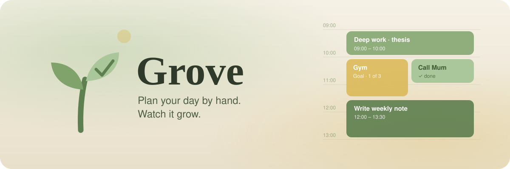
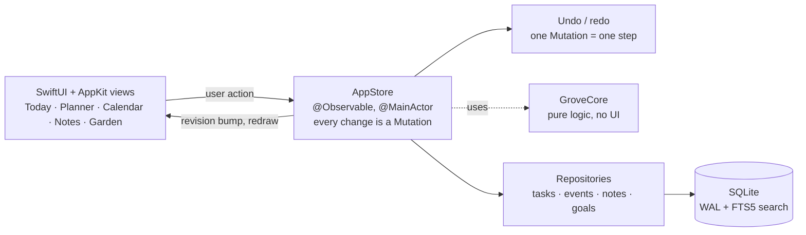

<p align="center">
  <picture>
    <source media="(prefers-color-scheme: dark)" srcset="docs/images/banner-dark.svg">
    
  </picture>
</p>

<h3 align="center">Your day, your tasks, your notes and your goals.<br>One calm place that grows with you.</h3>

<p align="center">
  
  
  
  
  
</p>

<p align="center">
  <a href="#-install"><b>Install</b></a> ·
  <a href="#-what-grove-does"><b>Features</b></a> ·
  <a href="#-who-its-for"><b>Who it's for</b></a> ·
  <a href="#-how-it-works-for-the-curious"><b>How it works</b></a>
</p>

<!-- SHOT: today (light + dark) -->

---

## Why Grove

Most planners make you choose. A to-do list *or* a calendar. Notes *or* a schedule.
You end up with five apps, and none of them know about each other.

Grove puts it all in one window, and ties it together.

<table>
<tr>
<td width="33%" valign="top">

### ✋ Plan by hand
Drag a task onto your day. It becomes a block of time.
Drag it to move it. Pull its edge to make it longer.
It snaps to 15 minutes and every move can be undone.

</td>
<td width="33%" valign="top">

### 🔗 Everything connects
A task can live in a note. A note can link to an event.
A meeting block gets its own note with one click.
Nothing is an island.

</td>
<td width="33%" valign="top">

### 🔒 Yours, and only yours
No account. No cloud. No tracking. No network at all.
Your data lives in one file on your Mac,
with automatic backups.

</td>
</tr>
</table>

---

## 🌱 What Grove does

### Today — the Day Planner
The heart of Grove. A timeline of your day, with your tasks on the side.

- **Drag** a task onto the timeline, or drag on empty time to make a block.
- **Move and resize** blocks with the mouse. Blocks can overlap; they sit side by side.
- A **workload bar** shows how full the day is. It turns red when you plan too much.
- Start a **focus timer** on any block.
- Yesterday's unfinished blocks? Grove offers to **roll them over**.

### Planner — your week at a glance
Seven days side by side. Drag blocks between days. Zoom in and out with `⌘ =` and `⌘ −`.

<!-- SHOT: planner -->

### Tasks that understand you
Type one line. Grove reads it.

```text
Call Mum tomorrow 6pm for 20m #family !2
```

That is a task for tomorrow, with a 20-minute block at 6 pm, a `family` tag and medium priority.
Also understood: `every monday`, `next week`, `someday`, `/list`, dates like `12/10` (day/month).

Lists, tags, priorities, subtasks, due dates, repeating tasks, eight colours, and a
priority outline so the important things stand out.

### Goals — time for what matters
Some things have no date. You just want to do them *enough*.

- Make a goal in **Hours** ("5 h of reading a week") or **Sessions** ("3 gym sessions a week").
- Drag the goal onto your day to plan time for it.
- Tick the block done when you did it.
- The goal shows **done** and **planned** for the week, side by side. Next week starts fresh.

<!-- SHOT: goals -->

### Notes, linked to your life
- A **daily note** for every day and a **weekly note** for every week.
- Link anything with `[[double brackets]]`: tasks, events, other notes.
- Checkboxes in a note become real tasks.
- Add images. Tag how the day felt, and tint your calendar by **mood**.

<!-- SHOT: notes -->

### Calendar
A month view with your events, a dot for each open task and a leaf for each day with a note.
Click a day to jump to that week.

### Garden 🌿
Every task you finish helps a small plant grow, through twelve stages.
It is a quiet reward for a good day.

<!-- SHOT: garden -->

### Four themes, light and dark
**Grove** (natural, the default), **Minimal**, **Futuristic** and **Vintage**.
Each one has its own colours, fonts and shapes, in a light look and a dark look.
Soft light drifts in the background. Motion can be turned off, and Grove follows
the macOS *Reduce motion* setting.

<!-- SHOT: themes -->

### Small things that feel good
- **Command palette** (`⌘ K`) to find and do anything.
- A **menu bar leaf** that shows what is now and what is next.
- **Reminders** before blocks start.
- **Settings** behind the gear: theme, light or dark, busy-day limit, mood tint and more.
- **Undo everything** with `⌘ Z`.

<details>
<summary><b>Keyboard shortcuts</b></summary>

| Keys | Action |
|---|---|
| `⌘ N` | New task |
| `⌥ ⌘ N` | New note |
| `⇧ ⌘ N` | New event |
| `⌘ T` | Today |
| `⌘ 1` … `⌘ 5` | Planner · Tasks · Calendar · Notes · Garden |
| `⌘ K` | Command palette |
| `⌘ =` / `⌘ −` | Zoom the planner |
| `⌘ Z` / `⇧ ⌘ Z` | Undo / Redo |
| `Space` | Tick the selected block done |

</details>

---

## 🙋 Who it's for

- **Time-blockers.** Students, makers, freelancers and anyone who plans the day in blocks.
- **People tired of five apps.** Tasks, calendar, notes and goals in one window.
- **Privacy people.** Your plans never leave your Mac.
- **Mac lovers.** Grove is native. It is fast, it uses Mac fonts, and it feels at home.

---

## 📦 Install

| Platform | Status | How |
|---|---|---|
| 🍎 **macOS** 26+ (Apple Silicon) | ✅ Ready | Build from source — 3 commands, below |
| 🪟 **Windows** | 🌱 Coming | Planned |
| 🤖 **Android** | 🌱 Coming | Planned |
| 📱 **iOS / iPadOS** | 🌱 Coming | Planned |

### macOS

You need macOS 26 or newer and Apple's free Command Line Tools. You do **not** need Xcode.

```bash
# 1. Get Apple's Command Line Tools (skip if you have them)
xcode-select --install

# 2. Get Grove
git clone https://github.com/AndreiOprescu/Grove.git
cd Grove

# 3. Build and install
./scripts/install.sh
```

The script builds Grove, puts it in `~/Applications/Grove.app`, adds a **Grove** icon to
your Desktop and opens the app. The first build takes a few minutes.

**Update:** run `git pull` and then `./scripts/install.sh` again. Your data stays safe.

**Uninstall:** quit Grove, then delete `~/Applications/Grove.app` and the `Grove` icon on
your Desktop. Your data is in `~/Library/Application Support/Grove/`. Delete that folder
only if you want to erase everything.

### Windows, Android and iOS

These are on the way. The plan is one shared app built with
[Flutter](https://flutter.dev), with optional sync between your devices.
Read the plan: [`docs/cross-platform-plan.md`](https://github.com/AndreiOprescu/Grove/blob/feat/cross-platform-flutter/docs/cross-platform-plan.md).

---

## 🔧 How it works (for the curious)

Grove is a native SwiftUI app with **zero third-party packages** and **no Xcode project**.
It builds with Swift Package Manager and a shell script.



**Two modules.**
- `GroveCore` is plain Swift with no UI imports. It holds the models, the database,
  migrations, the planner maths (snapping, overlap columns, free time), the quick-add parser,
  repeat rules, search, backups and export. It is where most of the tests live.
- `Grove` is the app: SwiftUI views, the `AppStore`, themes and the menu bar.

**One way to change data.** Every edit is a `Mutation` sent through `commit`. That gives
undo and redo for free, and keeps the database and the screen in step.

**SQLite, straight from the system.** No ORM and no SwiftData. Grove talks to the
`sqlite3` C library. The schema moves forward with numbered migrations
(`PRAGMA user_version`). Full-text search uses an FTS5 table.

**Local time, on purpose.** Dates are stored as local wall-clock text
(`2026-10-09T14:30`). It is a personal, one-device app, so there are no time-zone surprises.

**Art in code.** There are no image files in the app. The icon is drawn by
`scripts/make_icon.swift`. The garden, the plant and the drifting background light
are drawn by SwiftUI at run time.

**Tested.** 1028 tests with Swift Testing. Run them with:

```bash
./scripts/test.sh
```

<details>
<summary><b>Project layout</b></summary>

```text
Sources/
├─ GroveCore/        pure logic (no UI)
│  ├─ Model/         Task, Event, Note, Goal, Recurrence, DayKey …
│  ├─ Database/      SQLite wrapper, migrations, repositories
│  ├─ Planner/       PlannerMath: snap, overlap layout, free slots
│  ├─ Parsing/       quick-add, note links, @dates, markdown
│  ├─ Recurrence/    repeat rules
│  └─ Services/      search, backup, export, garden, reminders, roll-over
└─ Grove/            the app (SwiftUI)
   ├─ Planner/  Tasks/  Calendar/  Notes/  Goals/  Garden/
   ├─ Editor/        rich text for notes and task bodies
   ├─ Theme/         four themes, ambient light, the growing plant
   ├─ Settings/  MenuBar/  Reminders/  Layouts/  Shared/
   └─ AppStore*.swift
Tests/               GroveCoreTests, GroveTests
scripts/             build_app.sh · install.sh · test.sh · make_icon.swift
docs/                assumptions, acceptance proof
```

</details>

---

## 🗺️ Roadmap

- [x] Day Planner, tasks, calendar, notes, goals, garden
- [x] Four themes, each in light and dark
- [ ] Windows, Android and iOS with Flutter
- [ ] Optional sync between devices
- [ ] A ready-made download for macOS

---

<p align="center">
  <sub>Made with care by <a href="https://github.com/AndreiOprescu">Andrei Oprescu</a>. Grown, not built. 🌱</sub>
</p>
